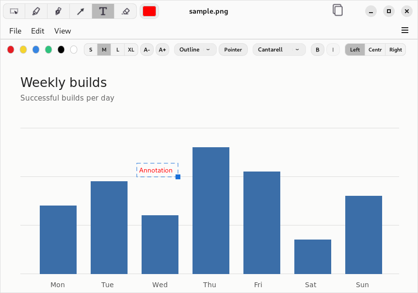
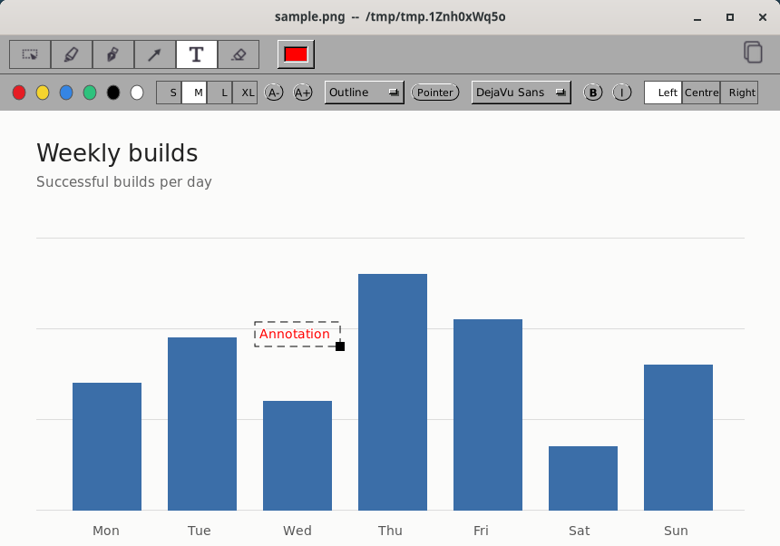
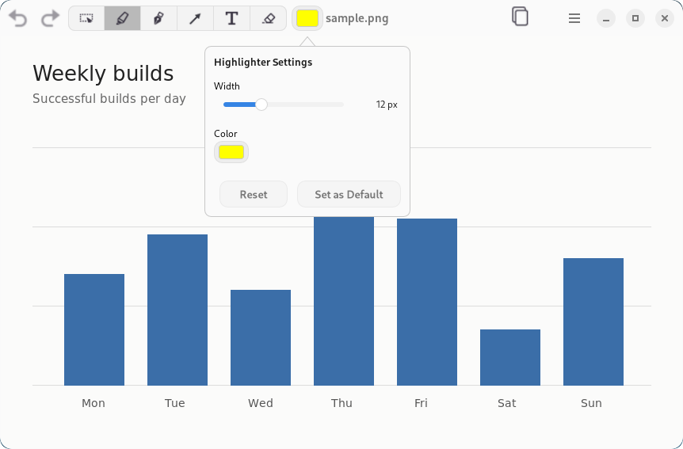

# ScreenshotTool

ScreenshotTool is a desktop screenshot annotation app. Open an image or paste
one from the clipboard, mark it up with pens, highlighters, arrows, text and
callouts, then copy the result, save it as an image, or save it as a project
you can keep editing.

Current build targets:
- GNUstep on Linux and BSD desktops
- Windows, as an MSI built with GNUstep under MSYS2 CLANG64 (see `docs/Packaging.md`)
- macOS, as a universal (Apple silicon and Intel) app built natively with AppKit, in a DMG

## Features
- Pen, highlighter, arrow, text, select and eraser tools. Pen, highlighter and
  text colours and widths are set from each tool's popover (double-click its
  toolbar button) and remembered as defaults.
- Text labels with a text bar for font, size, style and alignment; turn on
  Pointer to make a label a callout with a draggable pointer.
- Select, move and delete annotations; undo and redo every change from the
  toolbar or the Edit menu.
- Paste as New Image from the clipboard; Copy puts the annotated image (or the
  selection) on the clipboard with transparency intact.
- Save As writes a flattened PNG or TIFF. Save Project writes a `.screenshottool`
  file with the original image and editable annotations, which Open and Open
  Recent read back.
- Crop to Selection, Fit to Window, fixed zoom levels and Zoom In/Out.
- Standard controls throughout, so the GNUstep theme decides the look,
  including the toolbar, symbolic icons and the open and save dialogs.

## Screenshots

The app is built from standard controls, and the GNUstep theme decides how it looks. The same
window, adding a text annotation:



Under the [Adwaita theme](https://github.com/danjboyd/plugins-themes-Adwaita), as on a GNOME
desktop: the toolbar sits in the header bar.



Under GNUstep's default theme, with the window manager's title bar.



A tool's width and colour, from its toolbar button.

To regenerate these images, run `Tools/screenshots.sh` after building the app. It opens the app on a
private display under both themes, and saves each screen whole and cropped to its window
(`*-window.png`). The images here are `adwaita-text-toolbar-window.png`,
`default-text-toolbar-window.png` and `adwaita-popover-window.png`.

## Build

### Linux / BSD (GNUstep)

Prerequisites: `gnustep-make`, `gnustep-base`, `gnustep-gui`, Clang, and
standard build tools.

```bash
git submodule update --init --recursive
make -j"$(nproc)"
```

Notes:
- Open and save dialogs come from the GNUstep theme: under the
  [Adwaita theme](https://github.com/danjboyd/plugins-themes-Adwaita) they're
  GNOME's own file chooser.

### macOS (Cocoa-native)

```bash
scripts/build_cocoa.sh
scripts/smoke_macos_app.sh build/cocoa/ScreenshotTool.app
scripts/package_macos_dmg.sh build/cocoa/ScreenshotTool.app
```

Requires Xcode 26 or its Command Line Tools; GNUstep isn't needed. The build compiles the
sources and copies the resources `GNUmakefile` lists, and produces a universal app signed ad
hoc. Set `VERSION` to stamp a version, or `ARCHS=arm64` for a quicker one-architecture build.

Release DMGs aren't signed with a Developer ID yet, so macOS won't open the app the first
time: after the warning, click **Open Anyway** in System Settings → Privacy & Security, or
run `xattr -dr com.apple.quarantine /Applications/ScreenshotTool.app`. The DMG includes
these steps. Sparkle updates, Developer ID signing and notarization are planned (`macos.md`).

## Run

### Linux / BSD (GNUstep)

```bash
./ScreenshotTool.app/ScreenshotTool ~/Pictures/your-image.png
```

### macOS

Build `build/cocoa/ScreenshotTool.app` with `scripts/build_cocoa.sh`, then
`open build/cocoa/ScreenshotTool.app`. `scripts/smoke_macos_app.sh` launches it with a sample
image and fails if the image doesn't open.

Runtime logs default to `~/.local/state/screenshottool/screenshottool.log` on
GNUstep/Linux and `~/Library/Logs/ScreenshotTool/screenshottool.log` on macOS.
Set `SCREENSHOT_TOOL_LOG_PATH=/tmp/screenshottool.log` to override the log
location.

## Testing

Run the automated probes with:

```bash
make                 # the test bundle links libraries the app build produces
Tools/run_tests.sh
```

Run one class or test by name, or pass any `xctest` option (tests use the
[tools-xctest](https://github.com/danjboyd/tools-xctest) submodule; run
`git submodule update --init` after cloning):

```bash
Tools/run_tests.sh FitViewportRoundingProbeTests
Tools/run_tests.sh FitViewportRoundingProbeTests/testFitTurnsOffAutohidingScrollers
Tools/run_tests.sh -test-iterations 20 TitleBarToolbarProbeTests
```

Results go to `tests.log` and, as JUnit XML, `tests-junit.xml`.

Most tests need a window server. Without a desktop session (as in CI), run them
under a virtual display with `xvfb-run -a Tools/run_tests.sh`; the script fails
if tests had to skip for lack of a display.

### Screenshots

`Tools/screenshots.sh` captures the main screens (empty window, Preferences,
an image, the text bar, the tool popover) under GNUstep's default theme and
Adwaita on a private virtual display, into `screenshots/`. It needs Xvfb,
xdotool, x11-utils and ImageMagick, plus GNOME Shell or Openbox for window
decorations. Your GNUstep defaults are left untouched. CI uploads the images
as the `screenshots` artifact.

## Usage Tips
- Double-click a tool's toolbar button to open its popover.
- Preferences hold the drawing and text defaults, the default save folder
  and whether the status bar is shown.
- While editing text, `Ctrl+Return` or `Esc` finishes the label and `Return`
  starts a new line.
- Save As flattens the annotations into the image; use Save Project to keep
  them editable.

### Keyboard Shortcuts (GNUstep)
- Open: `Ctrl+O`
- Save As: `Ctrl+S`; Save Project: `Ctrl+Shift+S`
- Undo / Redo: `Ctrl+Z` / `Ctrl+Shift+Z`
- Copy: `Ctrl+C`; Paste as New Image: `Ctrl+Shift+V`
- Crop to Selection: `Ctrl+K`
- Fit to Window: `Ctrl+0`; 100%: `Ctrl+1`
- Zoom In / Out: `Ctrl+=` / `Ctrl+-`
- Preferences: `Ctrl+,`

## Project Docs
- Contributing and development notes: `CONTRIBUTING.md`
- Workflow and testing handoff: `WORKFLOW.md`
- Packaging and releases: `docs/Packaging.md`, `docs/Handoff.md`
- Bugs, feature requests and planned work: [GitHub Issues](https://github.com/danjboyd/ScreenshotTool/issues)

## License

GNU GPL v2 or later. See `COPYING`.
