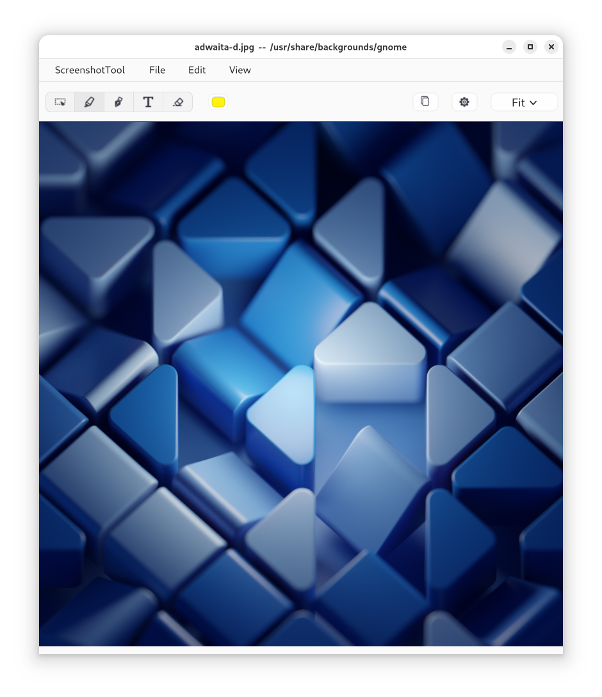

# ScreenshotTool

ScreenshotTool is a desktop screenshot annotation app. Open an image, mark it
up with pen, highlighter, eraser, and text tools, then save or copy the
annotated result.

Current build targets:
- GNUstep-based Linux and BSD desktops
- macOS via a Cocoa-native build path

## Features
- Pen, highlighter, eraser, and text tools with adjustable width and color.
- Live color badges on toolbar icons plus theme-aware light, dark, and Auto toolbar variants.
- Tool popovers on double-click and a full Preferences window for persistent defaults.
- Fit-to-window and fixed zoom presets (25%, 50%, 100%, 200%) with matching View menu items.
- Shared status bar controls for tool width, pixel readout, and quick reset/default actions.
- Copy-to-clipboard preserves transparency; Save As writes PNG or TIFF based on the chosen filename extension.

## Screenshots



Main editing window with an image loaded and the annotation toolbar visible.


Example markup workflow on a simple demo page image.

## Build

### Linux / BSD (GNUstep)

Prerequisites: `gnustep-make`, `gnustep-base`, `gnustep-gui`, Clang, and
standard build tools.

```bash
git submodule update --init --recursive
make -j"$(nproc)"
```

Notes:
- `USE_OPENSAVE=0` disables `third_party/libs-OpenSave` and falls back to pure GNUstep panels.
- `SCREENSHOT_TOOL_OPENSAVE_MODE=gnustep` forces GNUstep panel mode at runtime for fallback troubleshooting.
- GTK4 development files are needed for GTK-backed dialogs; without them, dialogs fall back to GNUstep behavior.

### macOS (Cocoa-native)

```bash
scripts/build_cocoa.sh
scripts/smoke_macos_app.sh build/cocoa/ScreenshotTool.app
scripts/package_macos_dmg.sh build/cocoa/ScreenshotTool.app
```

Requires Xcode Command Line Tools. The macOS build does not require the
GNUstep runtime.

## Run

### Linux / BSD (GNUstep)

```bash
./ScreenshotTool.app/ScreenshotTool ~/Pictures/your-image.png
```

### macOS

Build `build/cocoa/ScreenshotTool.app` with `scripts/build_cocoa.sh`, then open
the app bundle normally or use `scripts/smoke_macos_app.sh` for a quick launch
check.

Runtime logs default to `~/.local/state/screenshottool/screenshottool.log` on
GNUstep/Linux and `~/Library/Logs/ScreenshotTool/screenshottool.log` on macOS.
Set `SCREENSHOT_TOOL_LOG_PATH=/tmp/screenshottool.log` to override the log
location.

## Testing

Run the automated probes with:

```bash
make                 # the test bundle links libraries the app build produces
Tools/run_tests.sh
```

Run one class or test by name, or pass any `xctest` option (tests use the
[tools-xctest](https://github.com/danjboyd/tools-xctest) submodule; run
`git submodule update --init` after cloning):

```bash
Tools/run_tests.sh FitViewportRoundingProbeTests
Tools/run_tests.sh FitViewportRoundingProbeTests/testFitTurnsOffAutohidingScrollers
Tools/run_tests.sh -test-iterations 20 TitleBarToolbarProbeTests
```

Results go to `tests.log` and, as JUnit XML, `tests-junit.xml`.

Most tests need a window server. Without a desktop session (as in CI), run them
under a virtual display with `xvfb-run -a Tools/run_tests.sh`; the script fails
if tests had to skip for lack of a display.

### Screenshots

`Tools/screenshots.sh` captures the main screens (empty window, Preferences,
an image, the text bar, the tool popover) under GNUstep's default theme and
Adwaita on a private virtual display, into `screenshots/`. It needs Xvfb,
xdotool, x11-utils and ImageMagick, plus GNOME Shell or Openbox for window
decorations. Your GNUstep defaults are left untouched. CI uploads the images
as the `screenshots` artifact.

## Usage Tips
- Double-click toolbar buttons to open tool popovers.
- Use Preferences for persistent defaults such as toolbar theme, default save folder, and status bar visibility.
- Fit the canvas with View > Fit to Window or pick a fixed zoom level from the View menu.
- Crop to selection, copy annotated output, or Save As PNG/TIFF. The default save directory persists across sessions.

### Keyboard Shortcuts (GNUstep)
- Copy: `Ctrl+C`
- Save As: `Ctrl+S`
- Crop to Selection: `Ctrl+K`
- Zoom In/Out: `Ctrl+=` / `Ctrl+-`
- Preferences: `Ctrl+,`

## Project Docs
- Contributing and development notes: `CONTRIBUTING.md`
- Workflow and testing handoff: `WORKFLOW.md`
- Packaging: `docs/Packaging.md`
- Bugs and feature requests: GitHub Issues

## License

GNU GPL v2 or later. See `COPYING`.
